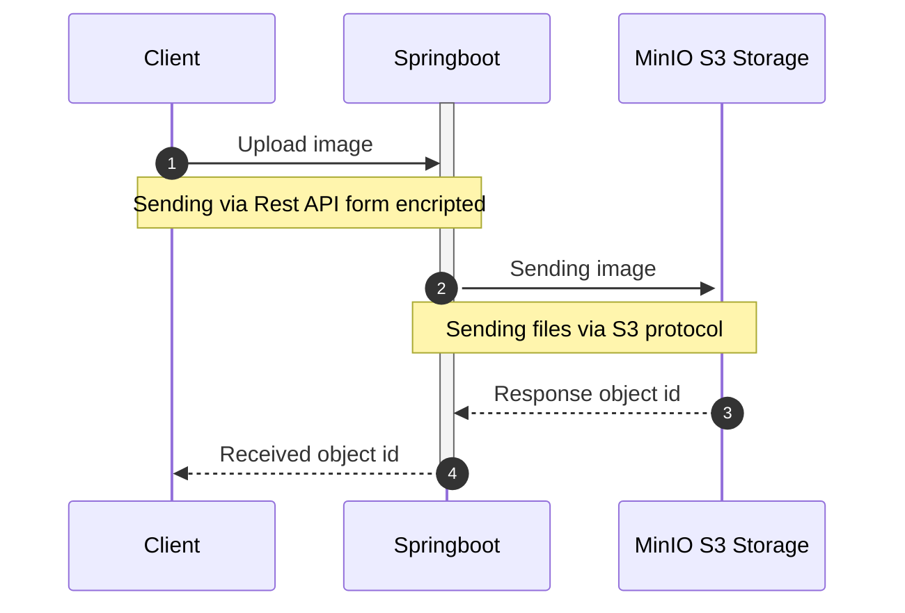
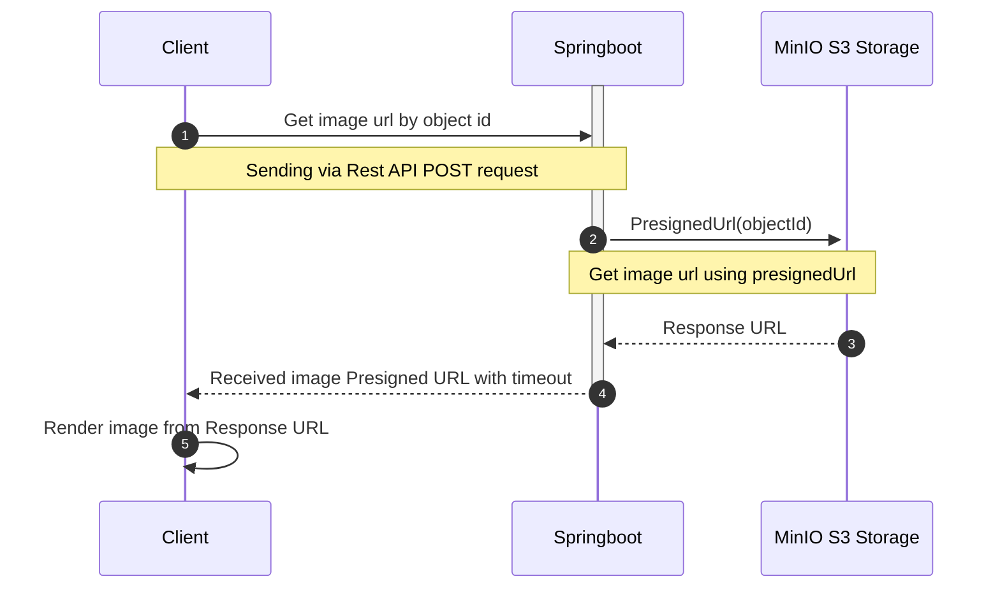

## OAuth 2.0 Resource server for Upload document

Example of Springboot upload/download files using MinIO, you can run locally

```bash
docker-compose -f .docker/docker-compose.yaml --env-file .docker/.env up -d
```

## Support S3 protocol

- [AWS S3](https://aws.amazon.com/s3/)
- [Google Cloud Storage](https://cloud.google.com/storage)
- [MinIO](https://min.io/)

## Workflows

1. Upload document



2. Presigned image URL string to download




## Maintainers

- Dimas Maryanto <software.dimas_m@icloud.com>

if you want to contribute please email me.
